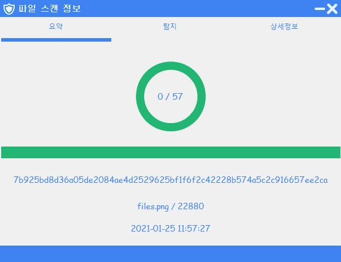
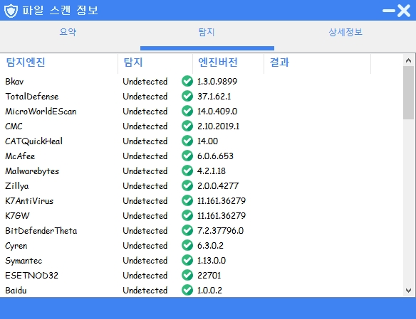
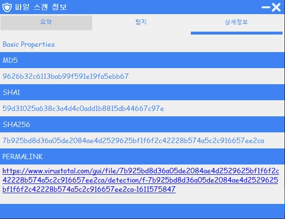
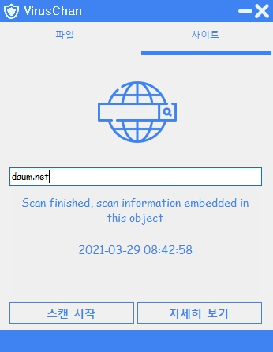
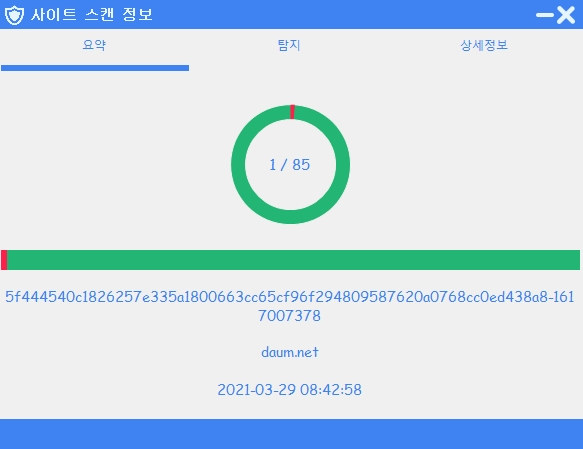
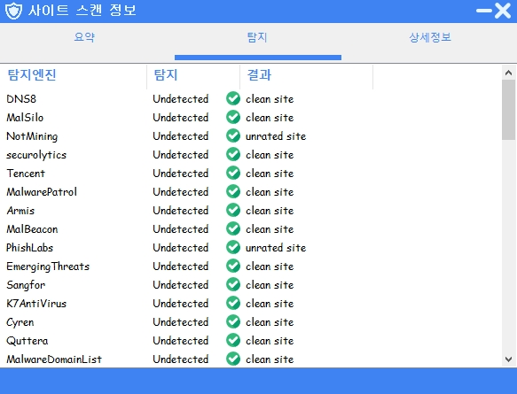
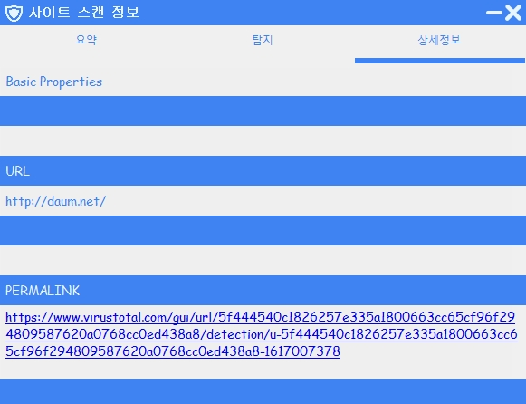
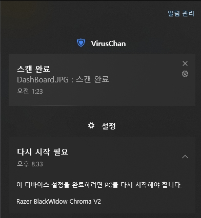
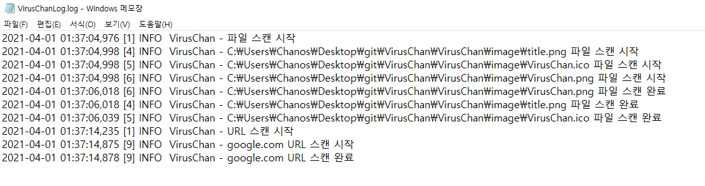

---
### C# VirusChan Project  :)  
##### 환경 : `Visual Studio 2017`, `Windows 10`
---

- Icon 사이트 : [Icooon Mono](https://icooon-mono.com/), [flaticon](https://www.flaticon.com/)

---

#### FileScan
- 파일 스캔

---

#### FileScan_Summary
- 파일 스캔 요약

---

#### FileScan_Detection
- 파일 스캔 탐지

---

#### FileScan_Details
- 파일 스캔 상세정보

---

#### SiteScan
- 사이트 스캔

---

#### SiteScan_Summary
- 사이트 스캔 요약

---

#### SiteScan_Detection
- 사이트 스캔 탐지

---

#### SiteScan Details
- 사이트 스캔 상세정보

---

#### ScanBalloon
- 스캔 메시지

---

#### Log
- 스캔 Log

---
